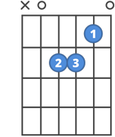

# TABS

A TABS é uma linguagem desenvolvida para músicos que querem acompanhar suas cifras. Com a TABS, é possível criar e testar as cifras, em conjunto com a lógica da programação.

## Como funciona

A linguagem utiliza tipos int e song, de forma que seja possível realizar operações entre ambos os tipos.

### Para criar uma música

Para criar uma música, o ideal é definir uma variável para esta música.

As variáveis do tipo *song* são criadas da forma:

``` NOME_DA_VARIAVEL = "|N-N-N-N-N-N|, |M-M-M-M-M-M|, ..." ```

Primeiro, note que o nome da variável de música está em letra maiúsucula. Isso é um requisito para definir variáveis do tipo *song*

O valor a ser atribuído à variável é definido da forma ` "|N-N-N-N-N-N|, |M-M-M-M-M-M|, ..." ` como exemplificado acima. Este valor é composto de diversas Tabs separadas por vírgulas. **Não é necessário atribuir um valor ao definir uma variável**.

### Tabs

As *tabs* são um componente essencial para a criação de *songs*.  
Uma *tab* é composta de um `|`, que abre a *tab*, seguido por 6 valores separados por `-`.

Cada valor pode assumir um inteiro de `0` a `30`, ou `X`. 

O valor numérico representa qual casa do violão será tocada na corda do índice do valor. Caso o valor seja `X`, a corda não será tocada.

### Exemplo de Tab

O acorde Am:



Representado em uma Tab, fica:

``` |X-0-2-2-1-0| ```


